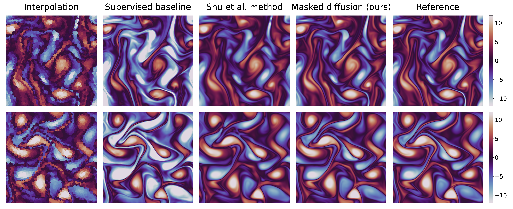
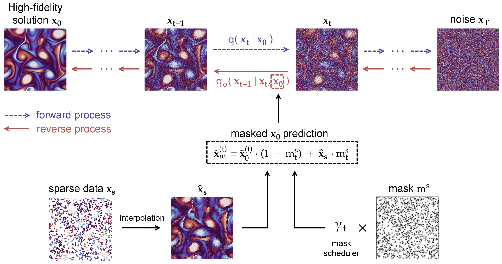

# Diffusion based sparse reconstruction



<p align="center">
This is code is the implementation of the framework presented in our article <b>"Guiding diffusion models to reconstruct flow fields from sparse data"</b> <br> [<a href="__blank">Arxiv</a>]
</p>




The repository currently contains the network and training codes for the 2D scenario (3D scenario coming soon).  


## Model
The architecture of the U-net network behind the model can be found in `networks.py`. The implementation of our guidance approach for diffusion models can be found in the `diffusion.py` file, where the proposed masked diffusion procedure is implemented with the method `masked_diffusion()` of the `Diffusion` class.


## Dataset
The used dataset can be downloaded on the [repo](https://github.com/BaratiLab/Diffusion-based-Fluid-Super-resolution) of Shu et al. or through this [link](https://figshare.com/ndownloader/files/39181919). Then, it should be placed under the `data` folder, such that it can be found by the `KolmogorovFlowDataset` class from `datasets.py`. This class organizes the dataset in samples of 3 contiguous timesteps, which are used to train the models.


## Training
The training of these models was done using the `trainer.py` script. Run `python trainer.py --help` to visualize all the possible parameters, one example command can be:
```
python trainer.py --epochs 1000 --ndata 3000 --batch 5 --lr 1e-4 --eq_res 1e-5 --gamma 0.98 --last_lr 1e-5 --device 0 --loss_m l2 --method ConFIG
```

## Sampling examples
Examples of how to run the code are coming soon.